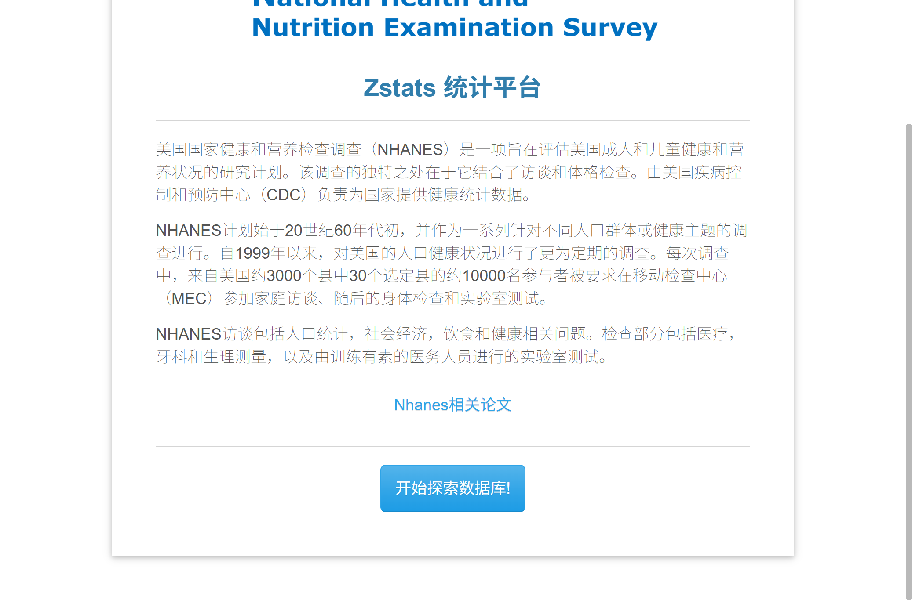
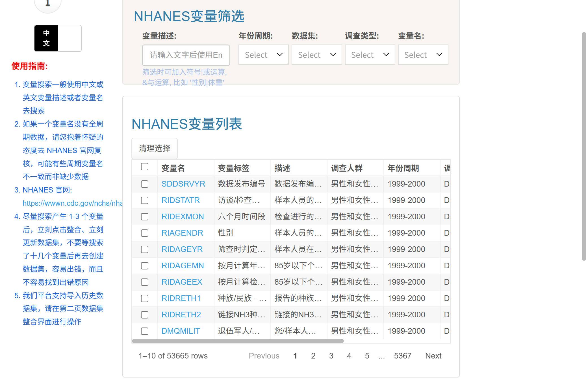
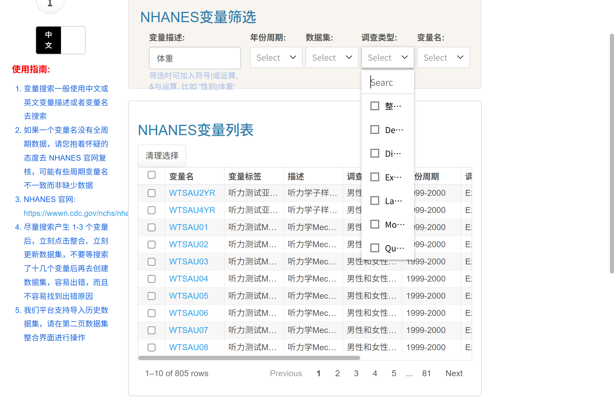

# NHANES 数据库入门与提取平台操作教程

> **一句话介绍**：这是一份写给"第一次用 NHANES 做研究"的人的中文教程。它不只教你点哪个按钮，更要让你明白**为什么要点这个按钮**——尤其是几乎所有人都会踩坑的**权重**问题。
>
> 平台地址：<https://zs.medsta.cn/nhanes_encryption/3.1/nhanes_data/nhanes_data_3.3.4/>
> 教程编写：2026-09 · 全部内容基于对平台的**真实全流程操作**与**数据产物解析**

---

## 写在前面

### 这份教程写给谁

- 临床医生 / 研究生，想用 NHANES 发一篇 SCI，但没系统学过复杂抽样；
- 已经会 SPSS/R，但被 NHANES 的"权重、周期、变量名不一致"搞晕的人；
- 用过这个平台，但只会照着别人的步骤点，不知道自己每一步在做什么的人。

### 学完你能做到

1. 说清楚 NHANES 的抽样设计，以及它为什么决定了你必须加权；
2. 在 6 类权重里**独立选对**该用哪一个；
3. 独立完成一次规范的数据提取：选变量 → 合并周期 → 摸数据 → 定人群 → 出权重 → 下载；
4. 把下载的数据导入 R/SAS，写出**带复杂抽样设计**的加权回归；
5. 看懂并主动避开 20 个常见坑。

### 建议的阅读方式

- **赶时间**：直接跳到[第六章 平台全景与登录](#/NHANES数据库入门与提取平台操作教程?id=第六章-平台全景与登录)开始操作，遇到不懂的再回查。
- **想学明白**：按顺序读。第一部分的四章（NHANES 是什么 → 为什么要加权 → 权重怎么选 → 数据怎么洗）是整个教程的地基，**读完这四章再去操作，能省下大量返工时间**。
- **只想抄作业**：直接看[第十三章 完整实战](#/NHANES数据库入门与提取平台操作教程?id=第十三章-完整实战-从零到一份加权分析)。

> 💡 教程里带 🔬 标记的是**真实实测数据**，不是估计值。所有数字都来自本教程编写时对平台的真实操作与对下载文件的解析。

---

# 第一部分 打好地基

## 第一章 五分钟认识 NHANES

### 1.1 它是什么

**NHANES**（National Health and Nutrition Examination Survey，美国国家健康与营养检查调查）是美国 CDC 下属的国家健康统计中心（NCHS）搞的一项**全国性、持续性、入户+体检的横断面调查**。

用最直白的话说：**美国每两年抽一万个人，把他们从问卷问到抽血验尿，全部测一遍，然后把数据免费公开给你做研究。**

| 项目 | 内容 |
|---|---|
| 负责机构 | 美国 CDC / NCHS |
| 起点 | 1960 年代；**1999 年起改为连续调查（Continuous NHANES）** |
| 开展方式 | 家庭访谈 → 移动检查中心（MEC）体检 → 实验室检测 |
| 抽样 | 每年从约 3000 个县中抽 15 个县，最终约 5000 人/年 |
| 周期 | 每 2 年一个周期（cycle），如 1999–2000、2001–2002 |
| 累计样本 | 1999–2023 共 **128,809** 人 🔬 |
| 费用 | 数据完全免费，无需申请 |

### 1.2 为什么大家都爱用它

对比一下你和身边人的处境：

| 痛点 | NHANES 的优势 |
|---|---|
| 自己收数据，一年攒不出几百例 | 一次能用上十几万人 |
| 只有问卷，没有客观指标 | 有身高体重、血压、血糖、血脂、骨密度、牙周、听力…… |
| 随访做不起来 | 有死亡随访数据（Mortality linkage）可做生存分析 |
| 花不起钱 | 完全免费、可重复、审稿人认 |
| 需要**健康人群**做参照 | 样本是普通人群，不是"病人样本"，可做患病率 |

但也有代价，见下一节。

### 1.3 代价：它的数据是"乱"的

NHANES 的数据不是一张漂亮的宽表，而是：

```
NHANES 1999-2023
├── 周期层   12 个 2 年周期（另有 2017-2020 这个 3.2 年的特殊周期）
│   ├── 1999-2000
│   ├── 2001-2002
│   └── ...
└── 文件层   每个周期 100+ 个数据文件
    ├── DEMO   人口学
    ├── BMX    体格测量
    ├── BPX    血压
    ├── BIOPRO 生化
    ├── DR1TOT 膳食
    ├── ...    还有问卷、死亡等等
```

**三个"乱"**：

1. **在哪个文件里** —— 一个指标可能在问卷文件里，也可能在体检文件里，你得先知道去哪找；
2. **跨周期改名** —— 同一个指标，2003 年叫这个名字，2011 年可能改名了；
3. **编码变过** —— 同上一个指标，不同周期的取值定义可能变过。

这就是为什么你会需要一个"提取平台"。

### 1.4 平台在这套体系里的位置

```
        NHANES 原始数据（CDC 官网）
                │  下载 .XPT 文件，手工合并
                │  ← 传统做法：耗时数周，极易出错
                ▼
   ┌────────────────────────────┐
   │  ZSTATS NHANES 提取平台     │   ← 本教程讲的平台
   │  · 已把 1999-2023 全部入库   │
   │  · 变量可搜可筛             │
   │  · 跨周期已对齐命名与编码    │
   │  · 自动补抽样设计与权重列    │
   │  · 自动生成统一权重          │
   └────────────────────────────┘
                │
                ▼
     一份可以直接进 R/SAS 的数据集
```

**平台真正帮你省掉的，是"对齐"和"权重"这两件最容易出错的事。**

但请注意：**平台能帮你把数据摆好，不能替你决定用哪个权重。** 那就是第二部分要解决的问题。

---

## 第二章 为什么不能直接把数据丢进回归

### 2.1 一个思想实验

假设你想估计"美国成人高血压患病率"。

你从 NHANES 拿到了 10,000 个人。其中 4,088 人患高血压。于是你说：

> 患病率 = 4088 / 10000 = **40.88%**

这个答案**错得离谱**。真实答案大约是 **34.45%**。

🔬 这是本教程实测的真实数字（1999–2004 三个周期、13,582 人）：

| 算法 | 高血压患病率 |
|---|---|
| 不加权直接算 | **40.88%** |
| 加权后算 | **34.45%** |
| 差值 | **高估 6.43 个百分点（相对高估 18.7%）** |

为什么错这么多？因为 NHANES **不是简单随机抽样**。

### 2.2 NHANES 的抽样是怎么做的

想象你要调查全中国 14 亿人的健康状况，但只有能力跑 20 个城市。你会怎么做？

你不可能拿着花名册随机抽 1 万人——那样抽到的人会散落全国，你根本跑不过来。真实做法是**分阶段抽**：

```
第一阶：从全美约 3000 个县里，抽 15 个县        ← 抽"县"
   ↓
第二阶：在每个抽中的县里，抽若干街区            ← 抽"街区"
   ↓
第三阶：在每个抽中的街区里，抽若干住户          ← 抽"住户"
   ↓
第四阶：在每个抽中的住户里，抽 1 个或多个人      ← 抽"人"
```

这叫 **多阶段整群抽样（multistage cluster sampling）**。除此之外还有两个关键设计：

**(1) 分层（stratification）**：先把全国按地理/城市化程度分成若干层，每层内独立抽样，保证地域覆盖均衡。

**(2) 过度抽样（oversampling）**：为了让少数族裔、老年人等群体的估计也够精确，会有意多抽这些人。

> 举个具体例子：美国 1999–2000 年非裔约占总人口 12%，但 NHANES 可能抽了 25% 的非裔。
> 结果就是：**在你的样本里，非裔"变多了"**。

### 2.3 后果：样本 ≠ 总体的缩影

因为过度抽样和不等概率，你的 10,000 人样本**不能代表**美国人口结构。

- 你的样本里老年人偏多 → 老年人高血压多 → **你算出的患病率偏高**；
- 高估的幅度还不是固定的，取决于你的指标和哪些群体被过度抽样了。

**这就像**：你想知道全校学生的平均身高，但你的"样本"里篮球队的人被抽了好多——那当然算出来偏高。权重就是用来"给篮球队的人少算一点分量，给普通学生多算一点分量"的那个东西。

### 2.4 三个必须记住的名字

平台的数据里，你会看到这三列，它们就是解决上面问题的钥匙：

| 变量名 | 含义 | 通俗解释 | 作用 |
|---|---|---|---|
| **weight**（权重） | 抽样权重 | "这个人代表总体的几个人" | 修正**点估计**（均值、率、OR） |
| **`SDMVSTRA`** | 分层变量 | "这个人属于哪个抽样的层" | 修正**方差**（标准误、CI、P 值） |
| **`SDMVPSU`** | 初级抽样单元 | "这个人属于哪个被抽中的小群体" | 修正**方差**（同一 PSU 内的人不独立） |

> **一句话记忆**：
> **权重管"算得准不准"，SDMVSTRA / SDMVPSU 管"误差算得对不对"。**

### 2.5 只做一半会怎样（真实演示）

很多人只知道要加权，不知道还要声明分层和 PSU。后果是：

🔬 同样一份数据（13,582 人），三种做法的对比：

| 做法 | 高血压患病率 | 标准误 | 95% 置信区间 | 问题 |
|---|---|---|---|---|
| ① 不加权 | 40.88% | 0.422% | 40.05 – 41.70 | ❌ 点估计错 |
| ② 加权，但不声明设计 | **34.45%** | 0.499% | 33.48 – 35.43 | ⚠️ 点估计对，**CI 太窄** |
| ③ 加权 + 声明分层/PSU | **34.45%** | **0.834%** | **32.82 – 36.09** | ✅ 正确 |

**设计效应 DEFF = 2.79**，意思是：这份数据的"有效样本量"只有名义上的 1/2.79 ≈ **36%**。你以为有 13,582 人，实际上信息量只相当于 **4,868** 人。

> **这就是为什么"只加权不声明设计"很危险**：
> 点估计是对的，但置信区间假窄了约 40%，**P 值会假性显著，本来不显著的结果被你说成显著**（假阳性）。

🔬 同一个坑在回归里的表现（高血压 ~ BMI + 年龄 + 性别）：

| 变量 | ① 未加权 OR (95%CI) | ② 加权+朴素SE | ③ 加权+设计校正 |
|---|---|---|---|
| BMI（每 +10） | 2.216 (2.071–2.372) | 2.429 (**2.428–2.431**) | 2.429 (2.234–2.642) |
| 年龄（每 +1 岁） | 1.070 (1.067–1.072) | 1.071 (**1.071–1.071**) | 1.071 (1.067–1.075) |
| 女性（vs 男性） | 1.035 (0.949–1.129) | 0.959 (0.958–0.959) | 0.959 (**0.845–1.088**) |

看第 ② 列：**置信区间窄到 `2.428–2.431`，这在真实世界里是不可能的**——这就是"假精确"。第 ③ 列才是能写进论文的结果。

> 注意一个有趣的细节：**BMI 的 OR 本身也从 2.216 变成了 2.429**。这说明不加权不仅让 CI 失真，**连效应量估计都是偏的**。

### 2.6 正确的做法：三行代码

任何软件里，正确做法都是"声明设计"三步走：

```r
library(survey)

des <- svydesign(
  ids     = ~SDMVPSU,      # ① 告诉软件：哪些人来自同一个抽样簇
  strata  = ~SDMVSTRA,     # ② 告诉软件：哪些人属于同一层
  weights = ~cycle_weight, # ③ 告诉软件：每个人代表多少人
  nest    = TRUE,          # ④ 关键！不同周期的 PSU 编号会重复，必须声明嵌套
  data    = dat
)

# 之后所有分析都用 "svy" 开头的函数
svymean(~推荐_高血压, des)                      # 加权患病率
svyglm(y ~ x, des, family = quasibinomial())   # 加权 logistic 回归
```

> ⚠️ **`nest = TRUE` 是新手最容易漏的一个参数**。
> 原因：NHANES 每个周期的 `SDMVPSU` 都是从 1 开始编号的。1999–2000 的 PSU=1 和 2001–2002 的 PSU=1 **不是同一个**。不加 `nest = TRUE`，软件会把它们当成同一个簇，标准误就算错了。

### 2.7 本章小结

- NHANES 是**复杂抽样**，直接算统计量一定偏；
- **权重**修正点估计，**分层 + PSU** 修正方差，两者缺一不可；
- 只加权不声明设计 → CI 假窄 → P 值假显著；
- `svydesign()` 里的 `nest = TRUE` 千万不能漏。

---

## 第三章 权重 全教程最重要的一章

> 如果你只读一章，就读这一章。权重选错，后面全白做。

### 3.1 先建立一个直觉

**权重 = "这个人在我的分析里，代表总体中的几个人"。**

举个极端简化的例子：

假设你的样本里只有 4 个人：2 个年轻人、2 个老人（老人被过度抽样了）。但真实人口里，年轻人和老人是 9:1。

| 人 | 年龄 | 真实应占比例 | 权重 |
|---|---|---|---|
| A | 25 | — | 4.5 |
| B | 25 | — | 4.5 |
| C | 70 | — | 0.5 |
| D | 70 | — | 0.5 |

权重 4.5 的意思是"这个人代表 4.5 个年轻人"，权重 0.5 的意思是"这个人只代表半个老人"。

算加权平均年龄：

$$\frac{25 \times 4.5 + 25 \times 4.5 + 70 \times 0.5 + 70 \times 0.5}{4.5 + 4.5 + 0.5 + 0.5} = \frac{225 + 70}{10} = 29.5 \text{ 岁}$$

而直接算的平均年龄是 $\frac{25+25+70+70}{4} = 47.5$ 岁。**天差地别。**

在真实 NHANES 中，权重的分布是这样的 🔬：

| 统计量 | 数值 |
|---|---|
| 权重合计 | 181,464,919（约 1.81 亿，对应美国目标人口） |
| 中位数 | 10,052 |
| 均值 | 13,361 |
| 范围 | 456 – 67,102 |
| **最大 / 最小** | **147 倍** |

**最大权重的那个人的"分量"，是最小权重那个人的 147 倍。** 这就是为什么要认真对待权重。

> **自检技巧**：如果你把某份数据的权重加起来，得到的是"几亿"这个量级，说明权重用对了（代表美国人口）。如果得到的是"一万"或"一亿亿"，说明用错了列或忘了折算。

### 3.2 为什么会有这么多套权重

关键问题：**你分析的那个变量，是谁测的？**

NHANES 的流程是分开的：

```
所有人 ──► 家庭访谈 ──► 得到"访谈样本"
              │           ↳ 有权重 WTINT2YR
              ▼
           去 MEC 体检 ──► 得到"体检样本"（比访谈少一部分人）
              │           ↳ 有权重 WTMEC2YR
              ▼
           做各种子样本检测（抽血、膳食回顾……）
                          ↳ 各有自己的子样本权重
```

**每经过一道关，样本都会掉一部分人。** 你的变量来自哪一关，就应该用哪一关的权重——因为只有那个权重才正确反映了"这批人是怎么被抽出来的"。

用错权重会怎样？

- **用了比变量覆盖范围更宽的权重**（比如变量只有体检子样本才有，你却用访谈权重）：软件会以为那些没测过的人也都在，**样本量虚高、标准误偏小**；
- **用了更窄的权重**：白白丢掉样本，效率降低，但不至于错得离谱。

> 所以有一句口诀：**"就低不就高"**——拿不准的时候，选覆盖范围更窄的那个。

### 3.3 NHANES 权重家族全表

| 权重系列 | 中文 | 覆盖人群 | 什么时候用 |
|---|---|---|---|
| `WTINT2YR` | 2 年**访谈**权重 | 完成家庭访谈的人 | 结局和暴露**全部来自问卷** |
| `WTMEC2YR` | 2 年**体检**权重 | 到 MEC 完成体检的人 | **含体格测量或实验室指标** ← 最常用 |
| `WTINT4YR` / `WTMEC4YR` | **4 年**权重 | 同上，但覆盖 4 年 | 分析 1999–2002 合并时 |
| `WTDRD1` | 膳食第 1 天权重 | 完成第 1 天 24h 膳食回顾 | 膳食摄入分析 |
| `WTDR2D` | 膳食第 2 天权重 | 完成第 2 天回顾（**人少很多**） | 需要 2 天平均摄入时 |
| `WTINTPRP` / `WTMECPRP` | **预处理周期**权重 | 2017–2020 子样本 | 用 2017–2020 周期时**只能用它** |
| `WTREP01`–`WTREP52` | 重复抽样权重 | — | 平衡重复复制法（BRR）估方差 |

### 3.4 权重选择决策树

照着下面这个流程走，5 步就能选对：

```
第 1 步：你的分析包含 2017–2020 这个周期吗？
   ├─ 是，且只用 2017–2020 ──────────────► 用 WT MEC PRP
   ├─ 是，且和其他周期合并 ───────────────► 用 WTMECPRP + 其他周期权重，
   │                                        再按"年数比例"折算（见 3.6）
   └─ 否 ──► 进入第 2 步

第 2 步：你的分析包含膳食摄入（24h 回顾）吗？
   ├─ 是，只用第 1 天 ────────────────────► 用 WTDRD1
   ├─ 是，需要 2 天平均 ──────────────────► 用 WTDR2D（人少，慎用）
   └─ 否 ──► 进入第 3 步

第 3 步：你的关键变量（结局或暴露）里有体格测量或实验室指标吗？
   │      例如：BMI、血压、血糖、血脂、骨密度、牙周……
   ├─ 有 ─────────────────────────────────► 用 WTMEC 系列   ← 大多数人走这条
   └─ 全部来自问卷 ───────────────────────► 用 WTINT 系列

第 4 步：你的分析包含 1999–2002 吗？
   ├─ 是，且只分析 1999–2002（4 年） ──────► 用 WTMEC4YR 原值
   ├─ 是，且与其他周期合并 ───────────────► 用 WTMEC4YR 再折算（见 3.6）
   └─ 否 ──► 进入第 5 步

第 5 步：合并了几个 2 年周期？（设为 k）
   └─ 统一权重 = (1/k) × WTMEC2YR 或 WTINT2YR
```

**最常见的答案**：`WTMEC2YR` 再除以周期数 `k`。

### 3.5 平台帮你做的：自动注入权重列

只要你选了变量并点了「更新数据集」，平台会**自动在数据里加上这些列** 🔬：

```
WTDRD1  WTDR2D  WTDRD1PP  WTDR2DPP       ← 膳食权重
SDMVSTRA  SDMVPSU                        ← 抽样设计（分层、聚类）★ 关键
WTINT4YR  WTMEC4YR                       ← 1999–2002 的 4 年权重
WTINT2YR  WTMEC2YR                       ← 各周期的 2 年权重
WTINTPRP  WTMECPRP                       ← 2017–2020 预处理周期权重
```

不适用的地方一律填 `#N/A`。实测各列的有效值个数（全量 128,809 人）🔬：

| 列 | 有效值个数 | 对应周期 |
|---|---|---|
| `WTINT2YR` / `WTMEC2YR` | 113,249 | 1999–2018 + 2021–2023 |
| `WTINTPRP` / `WTMECPRP` | 15,560 | 仅 2017–2020 |
| `WTINT4YR` / `WTMEC4YR` | 21,004 | 仅 1999–2000、2001–2002 |

113,249 + 15,560 = **128,809** ✅（两套体系恰好互补覆盖全部样本）

> 💡 **这意味着**：即使你不用平台的分析功能，也可以自己从这些列里挑一个正确的权重，在 R/SAS 里做加权分析。**这是平台很实用但很少有人注意到的一个设计。**

### 3.6 跨周期合并：1/k 规则

#### 规则本身

**把 k 个 2 年周期合并起来分析时，权重要除以 k：**

$$w_{\text{合并}} = \frac{1}{k} \times w_{2\text{年}}$$

#### 为什么要这样

直观理解：`WTMEC2YR` 这一列，在**每个周期内部**都已经校准好了——把它单独加起来，约等于"美国人口数"。

如果你把 3 个周期的 `WTMEC2YR` 直接相加，就会得到 **3 倍人口数**（约 8 亿），明显不对。

所以除以 3，让总和回到"人口数"这个量级。

> **类比**：你有 3 个班，每个班的"班费"都是 1000 元。合并成"年级"后，你不能说年级有 3000 元班费——如果班费代表"这个班的学生数"，那年级的学生数就是 1000（而不是 3000）。除以 k 就是做这个换算。

#### 特例：1999–2002

CDC 为 1999–2002 提供了专门的**4 年权重** `WTMEC4YR`。如果**只分析**这 4 年，直接用 `WTMEC4YR` 原值即可。

如果这 4 年还要和别的周期合并（比如总共 3 个周期 = 6 年），就要按"年数比例"折算：

$$w = WTMEC4YR \times \frac{4}{6} = WTMEC4YR \times \frac{2}{3}$$

#### 特例：2017–2020

这个周期因为疫情中止，实际是 2017–2019 年 3 月，约 **3.2 年**。CDC 只提供了 `WTMECPRP` / `WTINTPRP`。

- 只用 2017–2020：直接用 `WTMECPRP`；
- 与其他周期合并：按年数比例折算（3.2 ÷ 总年数）。

> ⚠️ **绝对不要同时选中 2017–2018 和 2017–2020**。
> 因为 2017–2020 这个周期本身就**包含了 2017–2018 的样本**，同时选等于把同一批人算了两遍。

### 3.7 平台的 cycle_weight 到底怎么算

平台在「权重提取步」会自动生成一个统一权重变量 **`cycle_weight`**，用它就不需要你自己折算了。那它内部是怎么算的？

本教程对它做了**逆向验证**（方法：下载带 `cycle_weight` 的数据，逐行计算 `各权重列 / cycle_weight` 的比值，看哪个比值恒定）。

#### 实验一：合并 3 个周期（1999–2000 + 2001–2002 + 2003–2004）

样本 15,169 人。逐周期统计比值 🔬：

| 周期 | 对比的权重列 | 比值分布 | 是否恒定 | 结论 |
|---|---|---|---|---|
| 1999-2000 | `WTINT4YR` | **1.5**（全部 4,823 人） | ✅ 精确恒定 | `cycle_weight = WTINT4YR × 2/3` |
| 1999-2000 | `WTMEC4YR` | 1.576, 1.603, 1.909… | ❌ 不恒定 | 不是它 |
| 2001-2002 | `WTINT4YR` | **1.5**（全部 5,350 人） | ✅ 精确恒定 | `cycle_weight = WTINT4YR × 2/3` |
| 2003-2004 | `WTINT2YR` | **3.0**（全部 4,996 人） | ✅ 精确恒定 | `cycle_weight = WTINT2YR × 1/3` |
| 2003-2004 | `WTMEC2YR` | 3.173, 3.217… | ❌ 不恒定 | 不是它 |

#### 实验二：只合并 2 个周期（1999–2000 + 2001–2002）

| 周期 | 比值 | 结论 |
|---|---|---|
| 1999-2000 | **1.0**（与 `WTINT4YR` 完全相等） | `cycle_weight = WTINT4YR × 1` |

#### 统一公式

$$\boxed{\texttt{cycle\_weight} = W_{\text{基础}} \times \frac{C_{\text{基础}}}{k}}$$

- $k$：你在纳排步选定的周期总数
- $W_{\text{基础}}$：该周期使用的基础权重
- $C_{\text{基础}}$：**基础权重覆盖的周期数**（4 年权重覆盖 2 个周期；2 年权重覆盖 1 个周期）

验证：

| 情形 | 基础权重 | $C_{base}$ | $k$ | 系数 | 实测 |
|---|---|---|---|---|---|
| 1999–2002, k=2 | `WTINT4YR` | 2 | 2 | 2/2 = **1** | ✅ |
| 1999–2002, k=3 | `WTINT4YR` | 2 | 3 | 2/3 = **0.667** | ✅ |
| 2003–2004, k=3 | `WTINT2YR` | 1 | 3 | 1/3 = **0.333** | ✅ |

#### 🔴 一个你必须知道的关键细节

**平台用的是"访谈权重" `WTINT` 系列，不是"体检权重" `WTMEC`。**

这是通过"比值精确恒定"这一强证据确定的：`WTINT4YR / cycle_weight` 在所有样本上**精确等于 1.5**，而 `WTMEC4YR / cycle_weight` 则因人而异。

**这对你意味着什么？**

| 你的关键变量 | 平台的 `cycle_weight` 是否合适 | 建议 |
|---|---|---|
| 全部来自问卷（如吸烟、饮酒、自报疾病） | ✅ 合适 | 直接用 |
| 含体格测量 / 实验室（如 BMI、血压、血糖） | ⚠️ 理论上应改用 `WTMEC` | 用下载文件里现成的 `WTMEC2YR`/`WTMEC4YR` 自己按公式折算 |

**自己折算的代码（R）：**

```r
k <- 3  # 你选的周期数
dat$wt_mec <- ifelse(
  !is.na(dat$WTINT4YR),           # 1999–2002 周期
  dat$WTMEC4YR * 2 / k,           # 4 年权重 × 2/k
  dat$WTMEC2YR * 1 / k            # 2 年权重 × 1/k
)
```

> 另外要提醒：**如果你的关键变量来自膳食，应该用 `WTDRD1`/`WTDR2D`**，平台默认也不会用这两个。

#### 与 CDC 官方口径的对比

| 方案 | 1999–2000 权重之和折算后 | 3 个周期合计 |
|---|---|---|
| CDC 标准 `(1/k) × WTMEC2YR` | 90,718,944 | ≈ 2.72 亿 |
| 平台方案 `WTINT4YR × 2/3` | 87,422,429 | ≈ 2.65 亿 |
| 官方 MEC 折算 `WTMEC4YR × 2/3` | 86,021,509 | ≈ 2.60 亿 |

三者量级一致（与 1999–2004 年美国人口同量级），**平台折算的方向与官方规则一致，差异在 3%–5%**。用于流行病学关联分析影响很小，但论文里最好说明你用的是哪种权重。

### 3.8 权重使用自检清单

做完权重处理，逐条对一遍：

- [ ] 权重列选的是**与关键变量来源匹配**的那一个（问卷→WTINT，体检→WTMEC，膳食→WTDR）？
- [ ] 如果合并了 k 个周期，权重**除以了 k**（或用等比折算）？
- [ ] 没有同时纳入 **2017-2018 和 2017-2020**？
- [ ] `SDMVSTRA` / `SDMVPSU` **都在**，且没有缺失？
- [ ] 分析时写了 **`nest = TRUE`**？
- [ ] 权重加起来是不是"几亿"这个量级（美国人口）？如果是几百或几万亿，肯定错了。
- [ ] 表 1 里的患病率/均值，与 CDC 官方公布的数字量级是否接近？

---

## 第四章 缺失值 特殊编码 与数据清洗

### 4.1 三类"缺失"，别混为一谈

看到空白别急着填。NHANES 里的"没有值"至少有三种含义：

| 类型 | 含义 | 处理方式 |
|---|---|---|
| **不适用（Not applicable）** | 这个人根本不该有这个变量。如"是否怀孕"对男性 | 视为缺失**或**单独归为一类，取决于分析 |
| **未调查（Missing）** | 该周期没测这个项目 | 视为缺失 |
| **拒答 / 不知道（Refused / Don't know）** | 问了但没得到有效答案 | **必须转为缺失**，不能当数值 |

第三类是最容易出错的，因为它们在原始数据里是**数字**（7、9、77、99……），软件会当成真实值参与计算。

### 4.2 NHANES 原始特殊代码

| 代码 | 含义 |
|---|---|
| `7` / `77` / `777` | Refused（拒答） |
| `9` / `99` / `999` | Don't know（不知道） |
| `.` 或空白 | 未调查 / 不适用 |

> **举例**：某变量的"每日吸烟支数"，如果某人拒答会被编码为 `777`。你直接算平均值，就会把这个人算成"每天抽 777 支"，结果被严重拉高。

**处理原则**：拿到任何原始变量，**第一步永远是看值分布 + 看变量说明页的编码表**。

### 4.3 平台输出的缺失标记

平台输出的文件里，缺失统一写成字符串 **`#N/A`**。

| 软件 | 读取表现 | 建议 |
|---|---|---|
| R `readxl::read_excel()` | 默认识别 `#N/A` 为 `NA` | 直接用平台自带的 `read_data.R` |
| Python `pandas.read_excel()` | 默认 `na_values` 含 `#N/A` | 直接可用 |
| Excel | 显示为文本 `#N/A` | 先用"排序/筛选"检查一遍 |
| SPSS | **可能读成字符串** | 读入后手动设为系统缺失值 ⚠️ |

平台自带的 R 脚本 `read_data.R`（下载包里就有）：

```r
library(readxl)
# 路径用正斜杠 /，不能用反斜杠 \
# guess_max 调大，防止数值列被误判成 TRUE/FALSE
data <- read_excel(path = "提取数据.xlsx", guess_max = 500000)
View(head(data, 10))
```

### 4.4 哪些缺失可以接受

平台在**阶段三「数据探索」**里会输出一张"变量缺失的分布"表。这是你做决策的依据。

🔬 全量 1999–2023（128,809 人）的实测缺失情况：

| 变量 | 缺失人数 | 缺失比例 |
|---|---|---|
| 推荐性别 / 推荐年龄 / 推荐_种族四分类 | 0 | 0.00% |
| 推荐PIR | 13,438 | 10.43% |
| WTDRD1（膳食第 1 天权重） | 27,364 | 21.24% |
| 推荐_BMI | 19,402 | 15.06% |
| 推荐_高血压 | 46,844 | **36.37%** |
| 推荐_吸烟状态 | 55,087 | **42.77%** |
| 推荐饮酒量_分类 | 86,996 | **67.54%** |
| WTDR2D（膳食第 2 天权重） | 56,615 | 43.95% |

**经验法则**：

| 缺失比例 | 判断 |
|---|---|
| < 5% | 基本无害，可考虑删除缺失个体 |
| 5% – 20% | 可接受，但要在局限性里说明 |
| 20% – 40% | 需要慎重，建议做敏感性分析 |
| > 40% | **很可能引入选择偏倚**，慎用，或考虑多重插补 |

**注意**：缺失往往不是随机的。比如 `推荐饮酒量_分类` 缺失 67.54%——因为未成年人、从不饮酒者、以及部分周期的特定人群不适用。**直接删除会让你的样本变成一个"饮酒者样本"**，结论完全不能外推。

### 4.5 缺失处理策略

```
某个变量缺失
   │
   ├─ 缺失 < 5% 且是协变量 ──► 可直接删除缺失个体（complete case）
   │
   ├─ 缺失是"不适用"导致的 ──► 慎重！可能需要单独归一类（如"不饮酒"）
   │
   ├─ 缺失 5%-40%，是协变量 ──► 多重插补（MI），或在局限性中说明
   │
   └─ 缺失是暴露或结局 ──────► 尽量不允许缺失，否则主分析不成立
```

**最重要的原则**（平台官方文档也这么写）：

> 对于重要的暴露因素与结局，尽量不缺失；如果协变量缺失，一般可以填补或者不填补。

### 4.6 平台在纳排步的一个便利开关

纳排页有个勾选框 **「是否自动剔除缺失」**，**默认勾选**。

- **勾选**：应用某个排除条件时，该条件涉及的变量有缺失的人会一并被剔除；
- **取消**：只按你写的条件排除，缺失的人保留。

> **建议**：默认保持勾选，但**每次都要回头看流程图上的 n 掉了多少**。如果某一步一下子掉了 40% 的人，说明这个变量的缺失率很高，你需要重新考虑它该不该放进模型。

---

## 第五章 跨周期整合的三个坑

平台把跨周期合并做得自动化了，但有三件事它**无法替你做**，必须人工核对。

### 5.1 坑一：同一个指标，不同周期变量名不同

**典型例子**：CDC 在不同周期给同一个指标换过变量名。平台的使用指南也专门提示：

> 如果一个变量名没有全周期数据，请您抱着怀疑的态度去 NHANES 官网复核，**可能有些周期变量名不一致而非缺少数据**。

**后果**：你以为"这个变量在 2009 年之后没有了"，其实是**改了个名字**。直接做趋势分析会得出"指标消失"的荒谬结论。

**怎么查**：

1. 在平台的变量列表里，点击**变量名那一列的超链接**，会跳到 NHANES 官网对应文件的说明页；
2. 在官网页面里搜索你的指标的**中文/英文含义关键词**，看它的分析注释（Analytic Notes）；
3. 用平台的"变量信息"表格（阶段二）查看 **`原变量名` vs `变量名`** 两列的差异。

### 5.2 坑二：同一个指标，不同周期编码值不同

**典型例子**：某分类变量在 1999–2000 是 `1=男, 2=女`，在 2005 年之后变成了 `1=男, 0=女`。

**后果**：合并后这个变量有 4 个"水平"（0, 1, 2, 还有 1 既代表男又代表女），回归结果完全错乱。

**怎么查**：

- 平台变量列表的**「变量编码」列**会直接列出每个周期的编码定义；
- 阶段二的「变量信息」表会给出 `变量编码` 与 `原变量编码` 的对照。

> **平台的建议（原文）**：
> "请考察并修改每个变量的变量值和变量名；保证不同周期的同个指标同个变量名；同时，请掌握同个指标不同周期变量值是否一致。"
>
> 翻译：**改名和改编码这两件事，平台给了工具，但判断得你自己做。**

### 5.3 坑三：周期重叠（2017–2020）

如前所述：**`2017-2018` 和 `2017-2020` 只能选一个。**

平台的纳排页原文就写着：

> 此外，2017-2020、2017-2018 两个周期，你只能选择一个周期。

**为什么**：2017–2020（PRP，Pre-Pandemic）是把 2017–2018 和 2019–2020 两部分合并成的 3.2 年样本。选两个 = 2017–2018 的人被算了两遍。

### 5.4 一个省心的替代方案：用"推荐协变量"

平台提供了一组**已经跨周期对齐好**的变量，叫 **推荐协变量**（详见[附录 A](#/NHANES数据库入门与提取平台操作教程?id=附录-a-推荐协变量全清单)）。

它们的「年份周期」列写的是 **`1999-2023`** ——意思是**一条记录就覆盖了全部周期**，变量名统一、编码统一，**完全不需要你自己合并**。

🔬 实测：`推荐协变量` 数据集共 **21 个变量**，每个都是 `1999-2023`。

**所以最佳实践是：**

> **能用推荐协变量 → 就用推荐协变量。**
> 平台没收录的指标 → 才走"原始周期变量"路径，此时必须人工核对变量名与编码。

---

# 第二部分 上手操作

## 第六章 平台全景与登录

### 6.1 平台是什么

它是 **ZSTATS 统计平台（风暴统计）** 下的一个专用子工具，用于把 NHANES 原始公开数据加工成分析级数据集。

| 项目 | 内容 |
|---|---|
| 站点 | `zs.medsta.cn`（跨域工具站） |
| 登录门户 | `www.zstats.cn` |
| 数据覆盖 | NHANES **1999–2023**，共 128,809 人 |
| 是否需要付费 | 需要 zstats 账号；部分功能可能需要会员 |

### 6.2 技术架构（给你一个心理预期）

这一节不是炫技——**知道它是 Shiny 应用，能解释你后面遇到的 80% 的"奇怪现象"**。

| 层次 | 实现 |
|---|---|
| 前端框架 | **R Shiny**（不是前后端分离的现代网站） |
| 表格 | `reactable` |
| 流程图 | `DiagrammeR` / `grViz`（在浏览器里渲染 Graphviz 图） |
| 通信 | WebSocket 长连接 |

**由架构推导出的三条重要结论：**

1. **它是"会话型"应用** —— 所有中间状态（购物车、整合结果、纳排条件、权重）都存在**服务器**上，不在你的浏览器里。所以**刷新页面 = 所有中间结果丢失**（登录状态会保留）。
2. **它是"服务端渲染"** —— 你点的每个按钮都要发给服务器算完再传回来，**网络慢的时候会感觉卡**。
3. **隐藏的元素不计算** —— Shiny 默认对不可见的输出"挂起"。所以**折叠面板必须展开、子标签必须点开，里面的内容才会生成**。这一条非常关键，详见[第十四章 排错手册](#/NHANES数据库入门与提取平台操作教程?id=第十四章-排错手册)。

### 6.3 页面结构

平台是一个**单页 6 个 Tab** 的结构：

| Tab | 名称 | 你要在这里做什么 |
|---|---|---|
| 1 | Home | 看简介 → 点「开始探索数据库」进入 |
| 2 | 数据查询步 | **选变量** |
| 3 | 数据整合步 | **合并周期、改名改编码、下载** |
| 4 | 数据探索步 | **摸数据、试跑回归** |
| 5 | 数据纳排步 | **定人群、画流程图** |
| 6 | 权重提取步 | **生成 cycle_weight、最终下载** |

### 6.4 登录过程

首次进入时可能出现一个"需要登录"的弹窗：



**流程**：点「去登录」→ 跳转到 zstats 门户 → 登录 → 自动带票据跳回平台 → 开始使用。

**如果卡在登录**：

- 确认浏览器**允许 localStorage**（隐私模式可能存不住登录凭证）；
- 换个浏览器或清一下缓存重试；
- 登录状态失效时会再次弹窗，重新登录即可。

### 6.5 五步工作流地图

把这张图存下来，操作时对照：

```
┌───────────────────────────────────────────────────────────────┐
│ Home ──「开始探索数据库」                                       │
└──────────────────────────────┬────────────────────────────────┘
                               ▼
【第 1 步 数据查询步】
   关键词搜索（回车）→ 叠加筛选（再回车）→ 勾选变量
        ↓
   变量购物车（上限 500）──「进行数据整合」
                               ▼
【第 2 步 数据整合步】
   「更新数据集」← 核心动作，跨周期合并
        ↓
   数据预览 / 变量信息 / 变量详情 / 改名改编码
        ↓
   下载数据（Excel / SPSS）──「进入数据探索」
                               ▼
【第 3 步 数据探索步】
   选模型 → 选 Y → 选 X → 区分分类变量 →「点击分析」
        ↓
   变量缺失的分布 / 单因素回归 / 多因素回归
        ↓
   「进入数据纳排」
                               ▼
【第 4 步 数据纳排步】
   选周期（决定 k）→ 展开 3 个排除模块 → 写条件
        ↓
   「创建/更新流程图」→ 核对每一步的 n
        ↓
   下载纳排后数据集 ──「进入权重提取」
                               ▼
【第 5 步 权重提取步】
   「设置权重」→ 生成 cycle_weight → 核对计算规则
        ↓
   下载带最终权重的数据 → 拿到压缩包 → 进 R/SAS
```

### 6.6 容量限制速查

| 限制 | 数值 |
|---|---|
| 变量购物车上限 | **500** 个 |
| 整合版数据集变量上限 | **80** 个 |
| 数据预览行数 | 每页 10 行，**且最多预览 20 行** |

> ⚠️ **预览只有 20 行**，千万不要用预览判断数据质量。**永远以下载文件为准。**

---

## 第七章 阶段一 变量筛选



### 7.1 界面导览

页面分四块：

| 位置 | 内容 |
|---|---|
| 左侧 | 平台内置的 5 条「使用指南」+ 中英文切换 |
| 右上 | **NHANES变量筛选** —— 5 个筛选条件 |
| 右中 | **NHANES变量列表** —— 结果表格（每页 10 行） |
| 右下 | **变量购物车** —— 已选变量 + 操作按钮 |

### 7.2 搜索：唯一需要"回车"的地方

「变量描述」框的提示是：**请输入文字后使用 Enter 回车键完成筛选**。

**两个必须记住的点**：

1. **必须按回车**。输完字不回车什么都不会发生。
2. **改了任何一个下拉筛选条件后，要回到这个框再按一次回车**，否则结果不会刷新。

> ⚠️ 第 2 点是平台一个明显的**交互缺陷**，也是新手最容易困惑的地方：
> "我明明把'调查类型'改成了'整合型指标'，为什么表格没变？"
> —— 因为它需要你再回车一次。

### 7.3 五个筛选条件

| 条件 | 类型 | 怎么用 |
|---|---|---|
| **变量描述** | 文本 | 关键词搜索，**回车生效**。支持 `\|`（或）、`&`（与） |
| **年份周期** | 多选 | 12 个周期；含 `1999-2004`、`1999-2018`、`1999-2023` 等预合并标签 |
| **数据集** | 多选 | 6 个精选数据集 + 数百个 NHANES 原始文件代码 |
| **调查类型** | 多选 | 整合型指标 / Demographics / Dietary / Examination / Laboratory / Mortality / Questionnaire |
| **变量名** | 多选 | 精选指标的中文名 |

#### 搜索运算符

| 写法 | 含义 | 例子 |
|---|---|---|
| `A\|B` | 或 | `性别\|体重` → 含"性别"**或**"体重" |
| `A&B` | 与 | `体重&年龄` → 同时含两者 |

#### 🔬 搜索行为实测（很重要）

| 你搜的内容 | 结果 | 说明 |
|---|---|---|
| `性别` | 29 行 | 命中 `RIAGENDR`(性别)、`DMDHRGND`(家庭参考人员性别) |
| `体重` | 805 行 | 连 MEC 权重变量（"Mec重量"）都被命中 |
| `高血压` | 178 行 | 含问卷 BPQ 系列 |
| `高血压` + 调查类型=整合型指标 | **44 行** | 收窄有效 |
| `健康状况_高血压` | **0 行** | ⚠️ **完整变量名搜不到！** 下划线不参与匹配 |

**结论：搜索是对"变量名 / 变量标签 / 描述"做模糊匹配，而且对符号不友好。**

> **最佳实践**：**用简短的核心中文词搜索**（如"高血压"、"BMI"、"吸烟"），再用左侧筛选器收窄。**不要试图输入完整变量名**。

#### 下拉框的两个小陷阱

1. **选项是虚拟滚动的**，DOM 里一次只出现约 20 个选项（看起来像"只有 20 个"，其实更多）；
2. **下拉框较窄，长文字会被截断**：比如"整合型指标"可能显示成"整…"。



> 所以浏览式选取容易漏，**关键词搜索更可靠**。

### 7.4 三类变量：本教程最需要你记住的概念

平台上实际存在**三种粒度完全不同**的数据。分不清它们，后面必错。

| | ① 原始周期变量 | ② 整合型指标（分周期） | ③ 推荐协变量（跨周期） |
|---|---|---|---|
| **长什么样** | 每个周期一条记录 | 每个周期一条记录 | **一条记录覆盖全部周期** |
| **年份周期列** | `1999-2000`、`2001-2002`… | 每个周期各一条 | **`1999-2023`** |
| **变量名跨周期一致吗** | ❌ 可能改名 | ✅ 一致 | ✅ 一致 |
| **编码跨周期一致吗** | ❌ 可能变 | ✅ 已统一 | ✅ 已统一 |
| **举例** | `RIAGENDR` | `健康状况_高血压`、`DASH_day1` | `推荐性别`、`推荐_BMI`、`推荐_高血压` |
| **要不要自己合并周期** | ✅ 要 | ✅ 要（按周期选多条） | ❌ 不用 |

🔬 举例：搜索"高血压"+整合型指标，得到 44 行，其中：

- `健康状况_高血压` 出现在 **12 个周期**（1999-2000 … 2021-2023），**要合并就要选 12 条**；
- `推荐_高血压` 只有 **1 条**，年份周期 = `1999-2023`，**选它一条就够了**。

> **决策规则**：
> **能用 ③ 就用 ③。** 平台没收录的指标才走 ①，并且必须人工核对变量名和编码。

### 7.5 怎么读变量列表

表格 8 列：

| 列 | 示例 | 你要注意什么 |
|---|---|---|
| 变量名 | `RIAGENDR` / `推荐_BMI` | **点它是超链接**，跳 NHANES 官网说明页 |
| 变量标签 | 性别 | 中文短标签 |
| 描述 | 样本人员的性别 | 变量含义 |
| **调查人群** | 男性和女性 0 岁 - 150 岁 | ★ **务必看**：如果你的研究限定成人，这里有年龄范围提示 |
| **年份周期** | `1999-2000` / `1999-2023` | ★ 判断是三类变量中的哪一类 |
| 调查类型 | Demographics / 整合型指标 | 来源模块 |
| 数据集 | `DEMO` / `推荐协变量` | 来源文件 |
| **变量编码** | `1: Male; 2: Female` | ★ **务必看**：确认取值定义，用于判断跨周期能否直接合并 |

> ★ 标记的三列是**每次都必须核对**的。

### 7.6 变量购物车

勾选左侧复选框 → 变量进入下方购物车（**跨页累积**）。

购物车显示 5 列：`变量名 | 描述 | 数据集 | 年份 | 调查类型`

**七个按钮：**

| 按钮 | 作用 | 什么时候用 |
|---|---|---|
| 清空购物车 | 清空当前购物车 | 选错了想重来 |
| 重新载入上一次提交至数据整合的购物车信息 | 回滚到上次提交时的清单 | **误操作的后悔药** |
| 保存购物车信息至本地 | 导出购物车文件 | 换个时间/电脑继续做 |
| 上传购物车信息 | 导入购物车文件 | 恢复进度 |
| 下载变量信息 | 下载变量元信息表 | 归档、写方法学部分 |
| 选择变量信息文件 + Browse… | 配合"上传"用的文件选择框 | — |
| **进行数据整合** | **提交 → 进入第 2 步** | 变量选好后 |

### 7.7 ★ 平台最重要的一条建议

平台使用指南第 4 条（原文）：

> **尽量搜索产生 1-3 个变量后，立刻点击整合、立刻更新数据集**，不要等搜索了十几个变量后再去创建数据集，容易出错，而且不容易找到出错原因。

**请严格遵守。** 理由：

- 平台的报错信息很粗糙，十几个变量一起提交出错时，你**根本不知道是哪个变量的问题**；
- 小批量提交，出错时一眼就能定位。

### 7.8 本阶段操作清单

- [ ] 在"变量描述"输入**核心中文词** → **按回车**
- [ ] 用"年份周期/数据集/调查类型"收窄 → **再按一次回车**
- [ ] 勾选变量（**优先选 `推荐协变量`**）
- [ ] 核对三列：**调查人群、年份周期、变量编码**
- [ ] 每 1–3 个变量就点一次「进行数据整合」

---

## 第八章 阶段二 数据整合

> 这是整个平台**最核心、也最容易出错**的一步。

### 8.1 界面导览

| 区块 | 控件 | 作用 |
|---|---|---|
| **本阶段已选变量** | 表格 | 从第 1 步提交来的变量 |
| | 重新载入最近历史变量信息 | 恢复上次清单 |
| | 保存 / 上传变量信息 | 导出 / 导入清单 |
| | 清空所选变量 | 清空 |
| **变量名/编码值修改** | 变量名修改 | 重命名变量 |
| | 变量值 1 / 变量值 2 / **确认修改** | 把值 1 改成值 2 |
| **数据集的全部变量（多周期整合版）** | 表格 | 整合后的预览（**只有 20 行**） |
| | **更新数据集** | ★ **执行跨周期合并** |
| | 移除所有已选变量(清除历史) | 重置 |
| | Excel / SPSS | 选下载格式 |
| | **下载数据** | 需先"更新数据集" |
| | 进入数据探索 | 去第 3 步 |
| **辅助** | 变量信息（下拉）+ 变量详情 | 看某变量的缺失与编码 |

### 8.2 「更新数据集」到底做了什么

点下这个按钮后，平台会：

1. **按 `SEQN` 把所选变量跨周期纵向拼接**（3 个周期的数据变成一张长表）；
2. **自动追加设计变量与权重列**（这是平台最贴心的设计）：

```
SEQN, Year, SDMVSTRA, SDMVPSU,
WTDRD1, WTDR2D, WTDRD1PP, WTDR2DPP,
WTINT4YR, WTMEC4YR, WTINT2YR, WTMEC2YR, WTINTPRP, WTMECPRP
```

3. 输出提示：`更新完成，纳入总变量: N个`

**三条铁律：**

- **必须先"更新数据集"，才能"下载数据"**（页面会提示"请更新数据，后再下载"）；
- **每次回第 1 步新增了变量，都必须重新"更新数据集"**，否则新变量不会进数据集；
- **预览只有 20 行**，别用它判断数据质量。

### 8.3 已选变量表怎么读

9 列：

```
变量名 | 变量标签 | 描述 | 调查人群 | 年份周期 | 调查类型 | 数据集 | 变量编码 | 新变量编码
```

前 8 列是信息，**最后一列「新变量编码」是编辑位**，配合"变量名/编码值修改"使用。

### 8.4 改名与改编码（跨周期对齐）

**使用场景**：你选了原始变量，发现两个周期名字或编码不一样。

**操作**：

1. 在「变量名修改」框里填新名字；
2. 如果要改编码，在「变量值 1」填旧值、「变量值 2」填新值；
3. 点「确认修改」。

**例子**：2001–2002 周期的某变量 `1=男 2=女`，2003–2004 周期 `1=男 0=女`。就把 0 改成 2，让两个周期统一。

> ⚠️ **改完务必回看「新变量编码」列**是否如你所愿。

### 8.5 变量信息 / 变量详情

这是核查数据质量的**核心工具**。

在「变量信息」下拉中选中一个变量，右侧「变量详情」会给出：

```
缺失个例: n = 13438
非缺失个例: n = 115371
编码信息:
    0 to 4.99: Range of Values;
    5: PIR value greater than or equal to 5.00
```

而「变量信息」表格给出的是改名对照：

| 变量名 | 年份周期 | 数据集 | 变量编码 | **原变量名** | **原变量编码** |
|---|---|---|---|---|---|
| 推荐性别 | 1999-2023 | 推荐协变量 | 1: Male; 2: Female | 推荐性别 | 1: Male; 2: Female |

★ **`原变量名` vs `变量名`、`原变量编码` vs `变量编码` 这两组对照，就是用来发现跨周期不一致的。**

### 8.6 下载

- **格式**：`Excel`（默认）/ `SPSS` 单选；
- **下载数据**：得到一个**压缩包**（不是单个 Excel），里面除了数据还有官方说明文档，详见[第十二章](#/NHANES数据库入门与提取平台操作教程?id=第十二章-下载产物与离线分析)；
- **下载变量信息**：只下载变量元信息。

### 8.7 本阶段操作清单

- [ ] 核对"已选变量"表里变量是否都到齐
- [ ] 用「变量信息/详情」看一遍关键变量的缺失和编码
- [ ] 跨周期变量**人工核对变量名和编码是否一致**，不一致就用改名/改值工具
- [ ] 点「更新数据集」，确认提示"更新完成"
- [ ] 选格式 → 「下载数据」
- [ ] 点「进入数据探索」

---

## 第九章 阶段三 数据探索

> 这个模块**不带权重**（标题就写着"探索性分析（不带权重）"），它只用来**摸底和试跑**，不能作为最终论文结果。

### 9.1 界面导览

| 区块 | 控件 |
|---|---|
| 顶部 | **点击分析**（提示"选择变量后再点击执行分析"） |
| **模型变量选择** | 回归模型：`线性回归` / `logistic回归` / `Cox回归`（单选） |
| **回归变量选择** | 连续型因变量（线性） |
| | 二分类因变量（取值为 0,1）（logistic） |
| | 生存结局变量 + 生存时间变量（Cox） |
| | 自变量（多选，**不要选权重变量**） |
| | 区分分类变量（多选） |
| **模型自变量筛选设置** | 单因素 P 值纳入阈值：`不限制` / `<0.2` / `<0.1` / `<0.05` |
| | 是否逐步回归：`否` / `双向` / `向前` / `向后` / `根据P<0.05筛选` |
| **输出区（3 组子标签）** | logistic：变量缺失的分布 / 单因素logistic回归 / 多因素logistic回归 |
| | 线性：变量缺失的分布 / 单因素线性回归 / 多因素线性回归 |
| | Cox：变量缺失的分布 / 单因素COX回归 / 多因素COX回归 |
| 底部 | **进入数据纳排** |

### 9.2 ★ 三条重要使用规则

**规则 1：结果要"点开子标签"才会出现。**

这是 Shiny 延迟渲染导致的。你点完「点击分析」后看到空白，**不是出错了，是那个子标签还没被展开**。点开"单因素logistic回归"、"多因素logistic回归"，结果就出来了。

**规则 2：变量全选好后，再点「点击分析」。**

改了变量要**重新点击**。

**规则 3：不要把 `Year` 和权重列当自变量。**

`Year` 是周期标识，权重列另有用途。

### 9.3 输出一：变量缺失的分布（最重要）

🔬 实测输出（1999–2023 全量）：

| Variables | Total | Freq | Miss (Percent) |
|---|---|---|---|
| SEQN | 128,809 | 128,809 | 0 (0.00) |
| 推荐性别 | 128,809 | 128,809 | 0 (0.00) |
| 推荐年龄 | 128,809 | 128,809 | 0 (0.00) |
| 推荐PIR | 128,809 | 115,371 | 13438 (10.43) |
| 推荐_吸烟状态 | 128,809 | 73,722 | 55087 (42.77) |
| 推荐饮酒量_分类 | 128,809 | 41,813 | 86996 (67.54) |
| 推荐_BMI | 128,809 | 109,407 | 19402 (15.06) |
| 推荐_种族四分类 | 128,809 | 128,809 | 0 (0.00) |
| 推荐_高血压 | 128,809 | 81,965 | 46844 (36.37) |

**怎么用这张表**：

1. **看总数 128,809** —— 这是平台内置的 1999–2023 全部样本；
2. **看每个变量的缺失比例** —— 缺失高的变量会大幅砍样本，要提前知道；
3. **估算最终样本量** —— 如果结局缺失 36%、吸烟缺失 43%，两个都要求完整，样本会掉到 40% 左右。

### 9.4 输出二：单因素回归

🔬 实测（Y = `推荐_高血压`，不带权重）：

| Variables | β | S.E | Z | P | OR (95%CI) |
|---|---|---|---|---|---|
| 推荐 BMI | 0.07 | 0.00 | 59.65 | <.001 | 1.07 (1.07 ~ 1.07) |
| 推荐年龄 | 0.06 | 0.00 | 133.06 | <.001 | 1.07 (1.07 ~ 1.07) |
| 推荐性别 | | | | | |
| &nbsp;&nbsp;1 | | | | | 1.00 (Reference) |
| &nbsp;&nbsp;2 | -0.04 | 0.01 | -2.92 | 0.004 | 0.96 (0.93 ~ 0.99) |
| 推荐 种族四分类 | | | | | |
| &nbsp;&nbsp;1 | | | | | 1.00 (Reference) |
| &nbsp;&nbsp;2 | 0.53 | 0.02 | 24.16 | <.001 | 1.70 (1.63 ~ 1.77) |
| &nbsp;&nbsp;3 | 0.73 | 0.02 | 30.26 | <.001 | 2.08 (1.99 ~ 2.18) |
| &nbsp;&nbsp;4 | 0.21 | 0.03 | 8.09 | <.001 | 1.23 (1.17 ~ 1.29) |
| 推荐 吸烟状态 | | | | | |
| &nbsp;&nbsp;0 | | | | | 1.00 (Reference) |
| &nbsp;&nbsp;1 | 0.64 | 0.02 | 35.13 | <.001 | 1.89 (1.82 ~ 1.96) |
| &nbsp;&nbsp;2 | 0.04 | 0.02 | 2.07 | 0.038 | 1.04 (1.01 ~ 1.08) |

> OR: Odds Ratio, CI: Confidence Interval

**读懂这张表：**

- **分类变量会自动展开**，并自动拿**第一个水平**当参照（Reference，OR=1.00）；
- **连续变量**给一行，`β` 是回归系数，`OR` 是它取指数后的值；
- **Z 值** = β / S.E，用来算 P 值；
- 这里的 OR 都是**未调整**的（单因素），只能用来**筛变量**，不能写进论文。

### 9.5 输出三：多因素回归

把"单因素 P 值阈值"内通过的变量一起放进模型，给出**调整后 OR**。同样会给一个 `Intercept` 行（一般不用报告）。

### 9.6 这个模块能做什么、不能做什么

| ✅ 能做 | ❌ 不能做 |
|---|---|
| 快速看缺失分布 | **不能加权**（没有权重，也没声明分层/PSU） |
| 快速筛变量 | 不能出亚组分析、趋势检验 |
| 看调整后效应方向 | **不能作为最终发表结果** |
| 确认变量编码是否可用 | 不能正确处理 Cox 的复杂删失 |

> **定位**：把它当成"数据体检 + 变量初筛"工具。**正式分析请回到 R/SAS，用平台输出的 `cycle_weight` 做加权分析。**

---

## 第十章 阶段四 数据纳排

> 这一步产出论文里必备的**研究对象筛选流程图（STROBE flow chart）**。

### 10.1 界面导览

| 区块 | 控件 | 作用 |
|---|---|---|
| **数据纳排, 绘制流程图** | 变量编码信息（下拉） | 查看变量编码 |
| | 缺失/非缺失例数面板 | 快速看变量覆盖 |
| | 保存 / 上传纳排信息 | 导出 / 导入纳排配置 |
| **纳入方式选周期** | 选择周期 | ★ **决定 k，进而决定权重折算** |
| **排除模块 1** | 添加纳排条件 / 清除所有条件 / 是否自动剔除缺失 | 一般人群筛选 |
| **排除模块 2** | 同上 | 暴露/结局的异常值与缺失 |
| **排除模块 3** | 同上 | 其他变量/协变量 |
| **纳排流程图** | **创建/更新流程图** | 生成流程图 |
| | 输出区 | SVG 流程图 |
| **下载** | Excel / SPSS | 格式 |
| | **下载纳排后数据集** | 需先"创建/更新流程图" |
| 底部 | **进入权重提取** | 去第 5 步 |

### 10.2 选择周期（最重要的一个决定）

平台原文：

> 说明：关键研究指标往往不是全周期都进行了调查，所以请慎重选择；此外，**2017-2020、2017-2018 两个周期，你只能选择一个周期**。

12 个周期：`1999-2000`、`2001-2002`、`2003-2004`、`2005-2006`、`2007-2008`、`2009-2010`、`2011-2012`、`2013-2014`、`2015-2016`、`2017-2018`、`2017-2020`、`2021-2023`。

**选周期时的三重考虑：**

| 考虑 | 说明 |
|---|---|
| ① 关键变量在哪些周期有？ | 用第 3 步的缺失分布 + 第 1 步的变量列表判断 |
| ② 要几个周期？ | 越多样本越大，但要注意 **k 越大权重系数越小** |
| ③ 有没有周期重叠？ | **2017-2018 与 2017-2020 二选一** |

> **`k` 就是这里选的周期数**。它在第 5 步会直接决定 `cycle_weight` 的折算系数，所以这一步要慎重。

### 10.3 三个排除模块分别管什么

平台给每个模块都写了说明，原文如下：

| 模块 | 平台说明 |
|---|---|
| **模块 1** 剔除不符条件的研究对象 | "我们开展数据分析的时候，很多时候往往会筛选子集进行分析，例如女性，老年人，高血压患者等，或者排除不符合条件的对象。" |
| **模块 2** 剔除暴露、结局的变量值不符合要求的研究对象 | "此处对最重要指标暴露因素、结局变量进行考察，排除异常值、排除缺失值(=NA)、排除你不感兴趣的对象。" |
| **模块 3** 剔除其他变量的变量值不符合要求的研究对象 | "如果其他变量或协变量的变量值不符合要求或者缺失(=NA)的对象，你需要排除，请慎重考虑开展纳排。" |

**推荐的使用顺序**（也是流程图输出的顺序）：

1. 先做**一般人群限制**（年龄、性别）→ 模块 1
2. 再做**暴露/结局有效**（排除缺失、异常值）→ 模块 2
3. 最后做**协变量完整** → 模块 3

### 10.4 「是否自动剔除缺失」

默认**勾选**。

| 状态 | 行为 |
|---|---|
| 勾选 | 应用排除条件时，该条件涉及的**变量缺失者一并剔除** |
| 不勾选 | 只按你写的条件排除 |

> **建议**：保持默认勾选，但**每次都要看流程图上的 n 掉了多少**。

### 10.5 怎么写排除条件

点击「添加纳排条件」后，出现一行条件编辑器：

```
[+排除条件 ▼]  [变量 ▼]  [运算 ▼]  [变量值 ______]  [删除条件]
    EXCLUDE      变量名      = / < / >      输入值
```

- 第 1 个下拉只有 `EXCLUDE` 一个选项（本模块只做排除）；
- **运算符共 8 个**（见[附录 B](#/NHANES数据库入门与提取平台操作教程?id=附录-b-纳排运算符表)）；
- **变量值框提示"请检查不要使用中文逗号"** —— 必须用**英文逗号**。

**平台给的两个语法示例（原文）：**

> 示例1：缺失值排除请使用 `=` 搭配 `NA`
> 示例2：范围值排除，比如排除 18-30 的值请使用 `区间(n1-n2)` 搭配 `18-30`

**常用条件写法：**

| 目的 | 变量 | 运算 | 变量值 |
|---|---|---|---|
| 排除缺失 | `推荐_高血压` | `=` | `NA` |
| 排除 18–30 岁 | `推荐年龄` | `ter`（区间） | `18-30` |
| 排除年龄 < 20 | `推荐年龄` | `<` | `20` |
| 排除 BMI > 60（异常值） | `推荐_BMI` | `>` | `60` |
| 排除男性 | `推荐性别` | `=` | `1` |
| 保留多类 | `推荐_种族四分类` | `include` | `1,2,3` |

### 10.6 流程图

点「创建/更新流程图」后，平台会**同时输出两样东西**：

**(1) 文字汇总**（每一步排除了多少人）——用来核对

**(2) SVG 流程图**——可以直接用作论文 Figure 1

🔬 实测（3 周期，条件：年龄 < 20 排除、高血压缺失排除）：

文字汇总：

```
• 使用排除条件 [推荐年龄 < 20] 和剔除缺失后, 排除个例
    - 推荐年龄 < 20: 15794
    -  缺失剔除: 0
• 使用排除条件 [推荐_高血压 = NA] 和剔除缺失后, 排除个例
    - 推荐_高血压 = NA: 163
```

流程图节点：

```
                  总记录 (n=31126)
                        │
        ┌───────────────┴───────────────┐
        │ Exclude:                      │
        │  • 推荐年龄 < 20      → 15794  │
        │  - 缺失剔除            → 0      │
        ├───────────────────────────────┤
        │ Exclude:                      │
        │  • 推荐_高血压 = NA    → 163    │
        ├───────────────────────────────┤
        │ Exclude: 0        (模块 2 未用) │
        ├───────────────────────────────┤
        │ Exclude: 0        (模块 3 未用) │
        └───────────────┬───────────────┘
                        ▼
                纳入记录 (n=15169)
```

**核对**：31126 − 15794 − 163 = **15169** ✅

> 💡 **一定要做这个减法核对**。如果对不上，说明你对"自动剔除缺失"的理解和平台不一致。

### 10.7 保存 / 上传纳排信息

- **保存纳排信息**：导出当前所有排除条件（并给出各条件的排除人数统计）；
- **上传纳排信息**：导入历史配置。

> ⚠️ 平台明确提示：**"上传后，请务必点开各纳排模块确认纳排信息"** —— 上传的配置可能因为变量缺失而部分失效。

### 10.8 下载

- **必须先"创建/更新流程图"**，否则"下载纳排后数据集"不可用；
- 输出同样是压缩包，数据文件名形如 `纳排数据提取.xlsx`。

---

## 第十一章 阶段五 权重提取

> 这是本平台**最大价值点之一**：自动生成跨周期统一权重。

### 11.1 界面导览

| 控件 | 作用 |
|---|---|
| 数据预览表 | 纳排后数据集（含全部权重列） |
| **设置权重** | ★ **生成 `cycle_weight`** |
| Excel / SPSS | 下载格式 |
| **下载带最终权重的数据** | 需先"设置权重" |
| 权重结果表 | 显示原始权重列 + `cycle_weight` |

### 11.2 平台说明（原文）

> 说明：请注意，先点击"设置权重按钮"，系统会生成该研究人群的权重。生成的最终权重变量名为 **`cycle_weight`**，下载数据后可联合分析系统一同使用。
> 另：所有整合型指标将有变量名，没有变量值，请大家不要修改变量名。数据分析模块时将自动匹配补全数据。

**三个要点：**

1. **必须先点「设置权重」**；
2. 最终权重变量名固定是 **`cycle_weight`**，**不要改名**；
3. **整合型指标的变量名也不要改**。

### 11.3 生成规则（速查）

完整推导见[第三章 3.7](#/NHANES数据库入门与提取平台操作教程?id=_37-平台的-cycle_weight-到底怎么算)。速查表：

| 周期 | 基础权重 | k=2 | k=3 | k=4 | 通用式 |
|---|---|---|---|---|---|
| 1999–2000、2001–2002 | `WTINT4YR` | ×1 | ×2/3 | ×1/2 | `WTINT4YR × 2 / k` |
| 2003–2004 及以后 | `WTINT2YR` | ×1/2 | ×1/3 | ×1/4 | `WTINT2YR × 1 / k` |
| 2017–2020 | `WTINTPRP` | — | — | — | 按年数比例 |

🔬 实测权重表（k=3）：

| SEQN | Year | WTINT4YR | WTINT2YR | WTMEC2YR | **cycle_weight** | 校验 |
|---|---|---|---|---|---|---|
| 2 | 1999-2000 | 14203.336 | 26678.636 | 28325.385 | **9468.890665** | 14203.336 × 2/3 ✅ |
| 5 | 1999-2000 | 44161.868 | 91050.847 | 99445.066 | **29441.245467** | 44161.868 × 2/3 ✅ |
| 7 | 1999-2000 | 11912.476 | 22352.089 | 25525.423 | **7941.650447** | 11912.476 × 2/3 ✅ |

### 11.4 ★ 必做：自己核对一遍权重

不要盲信平台。**拿到数据后，自己算一遍比值验证：**

```r
dat <- read_excel("权重数据提取.xlsx", sheet = "NHANES", guess_max = 5e5)

# 核对 1999-2002 周期
d1 <- dat[!is.na(dat$WTINT4YR), ]
print(summary(d1$WTINT4YR / d1$cycle_weight))   # 应该恒等于 1.5（k=3 时）

# 核对其他周期
d2 <- dat[is.na(dat$WTINT4YR), ]
print(summary(d2$WTINT2YR / d2$cycle_weight))   # 应该恒等于 3（k=3 时）
```

如果比值**不是恒定的**，说明基础权重列不是你预期的那个，需要进一步确认。

### 11.5 🔴 关于权重基础列的重要提醒

**平台的 `cycle_weight` 基于访谈权重 `WTINT` 系列，不是体检权重 `WTMEC`。**

| 你的关键变量 | 建议 |
|---|---|
| 全部来自问卷 | 直接用 `cycle_weight` |
| 含体检/实验室指标（BMI、血压、血糖……） | 自己用 `WTMEC2YR`/`WTMEC4YR` 折算 |

```r
k <- 3   # 你的周期数
dat$wt_mec <- ifelse(!is.na(dat$WTINT4YR),
                     dat$WTMEC4YR * 2 / k,
                     dat$WTMEC2YR * 1 / k)
```

### 11.6 本阶段操作清单

- [ ] 点「设置权重」，等待生成
- [ ] 在权重表里**核对 `cycle_weight` 与基础权重的比值是否恒定**
- [ ] 判断自己的关键变量是否含体检指标 → 决定是否改用 `WTMEC` 折算
- [ ] 点「下载带最终权重的数据」

---

## 第十二章 下载产物与离线分析

### 12.1 压缩包里有什么

每个阶段的"下载数据"返回的不是单个 Excel，而是一个**压缩包**，内含 4 个文件 🔬：

```
tmp/Rtmp<随机>/                     ← R 的临时目录，可忽略
├── 提取数据.xlsx                    ← 主数据
│   （阶段四是"纳排数据提取.xlsx"，阶段五是"权重数据提取.xlsx"）
├── 如何整理下载好的数据.docx          ← 官方整理说明 ★ 值得一读
├── 为什么部分变量的变量值缺失.txt      ← 关于整合型指标值为空的说明
└── read_data.R                     ← R 读取脚本
```

### 12.2 主数据结构

**工作表：**

| 工作表 | 内容 |
|---|---|
| `NHANES` | 主数据 |
| `变量编码` | 变量名 / 变量标签 / 变量编码 字典 ★ **写方法学部分很有用** |

**列结构**（以实测案例为例）：

```
SEQN                                     ← 个体编号（跨周期唯一）
推荐性别  推荐年龄  推荐PIR  …             ← 你选的变量
WTDRD1  WTDR2D  WTDRD1PP  WTDR2DPP       ← 膳食权重
Year                                     ← 周期标签
SDMVSTRA  SDMVPSU                        ← 抽样设计 ★ 必须有
WTINT4YR  WTMEC4YR                       ← 4 年权重
WTINT2YR  WTMEC2YR                       ← 2 年权重
WTINTPRP  WTMECPRP                       ← 2017–2020 权重
cycle_weight                             ← 【第 5 步生成】统一权重
```

### 12.3 官方说明文档原文摘要

**`如何整理下载好的数据.docx`：**

> 下载好的数据**不能直接分析**，需要整理，原因在于：部分变量的变量值需要转换、重新计算；部分个体需要剔除。
>
> 如何整理？
> - 对每个变量在 EXCEL 或者用 SPSS 打开后做个排序，检查数据最大值、最小值，查看有没有异常值、缺失值（**这个很重要，切记**）
> - 对必要的数据缺失填补、错误纠正、或者计算转换新变量
> - 对于重要的暴露因素与结局，尽量不缺失
> - 如果协变量缺失，一般可以填补或者不填补

**`为什么部分变量的变量值缺失.txt`：**

> 你们下载的 EXCEL 数据中，我们整理好的整合型指标的变量值是缺失的……你们只要**保持整合型的指标变量名不动**，直接导入我们分析平台，平台会自动补全所有数据。
> **切记：不要修改这些整合型指标的变量名！！！**
> 如果你想利用其它软件进行数据分析，则不妨下载原始数据进行进一步整理。

> 🔎 **本教程的补充实测**：在实测的三个案例中，`推荐_*` 系列整合型指标（推荐性别/年龄/PIR/BMI/种族四分类/吸烟状态/饮酒量分类/高血压）**都是真实数值**，缺失统一写为 `#N/A`，且缺失比例与第 3 步"变量缺失分布"完全一致。
> 所以"变量值缺失"更可能是针对**部分需要平台内部计算的指标**。
> **建议：下载后先抽查每个整合型指标的非缺失比例，确认后再决定用哪条通路。**

### 12.4 离线加权分析 R 完整代码

```r
# ---------- 1. 读取 ----------
library(readxl)
library(survey)

dat <- read_excel("权重数据提取.xlsx", sheet = "NHANES", guess_max = 500000)

# ---------- 2. 准备权重 ----------
k <- 3                                    # 周期数
dat$wt <- ifelse(!is.na(dat$WTINT4YR),    # 1999-2002 走 4 年权重
                 dat$WTMEC4YR * 2 / k,
                 dat$WTMEC2YR * 1 / k)    # 其他周期走 2 年权重

# ---------- 3. 声明复杂抽样设计 ----------
des <- svydesign(
  ids     = ~SDMVPSU,
  strata  = ~SDMVSTRA,
  weights = ~wt,
  nest    = TRUE,          # ★ 千万不能漏
  data    = dat
)

# ---------- 4. 描述性统计 ----------
# 加权患病率
svymean(~推荐_高血压, des, na.rm = TRUE)

# 按性别分层
svyby(~推荐_高血压, ~推荐性别, des, svymean, na.rm = TRUE)

# ---------- 5. 加权 logistic 回归 ----------
dat$推荐_性别_f <- factor(dat$推荐性别)
dat$推荐_种族_f <- factor(dat$推荐_种族四分类)
dat$推荐_吸烟_f <- factor(dat$推荐_吸烟状态)

des2 <- update(des, 推荐_性别_f = factor(推荐性别),
                    推荐_种族_f = factor(推荐_种族四分类),
                    推荐_吸烟_f = factor(推荐_吸烟状态))

fit <- svyglm(推荐_高血压 ~ 推荐_BMI + 推荐年龄 +
                推荐_性别_f + 推荐_种族_f + 推荐_吸烟_f,
              design = des2, family = quasibinomial())

summary(fit)

# 输出 OR 与 95%CI（论文用）
res <- cbind(
  OR    = exp(coef(fit)),
  Lower = exp(confint(fit)[, 1]),
  Upper = exp(confint(fit)[, 2]),
  P     = summary(fit)$coefficients[, 4]
)
print(round(res, 3))
```

### 12.5 SAS 示例

```sas
/* 加权患病率 + 卡方 */
proc surveyfreq data=dat;
  strata SDMVSTRA;
  cluster SDMVPSU;
  weight wt;
  tables 推荐_高血压 * 推荐_性别 / row chisq;
run;

/* 加权 logistic 回归 */
proc surveylogistic data=dat;
  strata SDMVSTRA;
  cluster SDMVPSU;
  weight wt;
  class 推荐_性别 推荐_种族四分类 推荐_吸烟状态 / param=ref ref=first;
  model 推荐_高血压(event='1') = 推荐_BMI 推荐_年龄 推荐_性别
                                 推荐_种族四分类 推荐_吸烟状态;
run;
```

### 12.6 Python 示例

```python
import pandas as pd
import statsmodels.api as sm
import statsmodels.formula.api as smf

dat = pd.read_excel("权重数据提取.xlsx", sheet_name="NHANES", na_values=["#N/A"])

k = 3
dat["wt"] = dat["WTMEC4YR"].where(
    dat["WTINT4YR"].notna(), dat["WTMEC2YR"]) * dat["WTINT4YR"].notna().map({True: 2/k, False: 1/k})

model = smf.glm(
    "推荐_高血压 ~ 推荐_BMI + 推荐_年龄 + C(推荐性别) + C(推荐_种族四分类)",
    data=dat, family=sm.families.Binomial(),
    freq_weights=dat["wt"]
).fit(cov_type="cluster",
      cov_kwds={"groups": dat["SDMVPSU"]})   # 至少声明聚类

print(model.summary())
```

> ⚠️ Python 生态缺少与 R `survey` 完全等价的复杂抽样支持，**正式发表建议用 R 或 SAS**。

### 12.7 其他导出文件

| 文件 | 用途 |
|---|---|
| 变量信息 | 变量元信息表 |
| 纳排信息 | 纳排条件配置 + 各步排除人数 |
| 购物车信息 | 变量清单，可跨会话复用 |

---

# 第三部分 实战与排错

## 第十三章 完整实战 从零到一份加权分析

### 13.1 研究问题

> **美国成人 BMI 与高血压的关联（多周期横断面研究）**

### 13.2 变量设计

| 角色 | 变量 | 说明 |
|---|---|---|
| 结局 Y | `推荐_高血压` | 0=No，1=Yes |
| 暴露 X | `推荐_BMI` | 连续 |
| 协变量 | `推荐年龄`、`推荐性别`、`推荐_种族四分类`、`推荐_吸烟状态` | — |
| 备用 | `推荐PIR`、`推荐饮酒量_分类` | — |

> 全部选 `推荐协变量`（`1999-2023`），**无需手工合并周期**。

### 13.3 逐步操作

#### 第 1 步 进入平台

1. 访问平台地址；
2. 若弹出登录弹窗 → 点「去登录」→ 在 zstats 门户登录 → 自动跳回；
3. 首页点「开始探索数据库!」。

#### 第 2 步 选变量

1. 「数据集」下拉 → 勾选 `推荐协变量`；
2. 表格显示 **21 行**，年份周期全是 `1999-2023`；
3. 勾选：`推荐性别`、`推荐年龄`、`推荐PIR`、`推荐_吸烟状态`、`推荐_BMI`、`推荐_种族四分类`、`推荐_高血压`；
4. 核对「变量编码」列；
5. 点「进行数据整合」。

#### 第 3 步 数据整合

1. 确认"本阶段已选变量"表格里 7 个变量都在；
2. 点「更新数据集」→ 等提示 `更新完成，纳入总变量: 7个`；
3. 格式选 `Excel` → 点「下载数据」；
4. 点「进入数据探索」。

#### 第 4 步 数据探索

1. 回归模型选 `logistic回归`；
2. 二分类因变量选 `推荐_高血压`；
3. 自变量多选：`推荐_BMI`、`推荐年龄`、`推荐性别`、`推荐_种族四分类`、`推荐_吸烟状态`；
4. 分类变量多选：`推荐性别`、`推荐_种族四分类`、`推荐_吸烟状态`；
5. 阈值选 `不限制`，逐步回归选 `否`；
6. 点「点击分析」；
7. **逐个点开右侧子标签**查看结果；
8. 点「进入数据纳排」。

#### 第 5 步 数据纳排

1. 「选择周期」勾选 `1999-2000`、`2001-2002`、`2003-2004`（**k = 3**）；
2. **展开**"剔除不符条件的研究对象"面板 → 点「添加纳排条件」→ 设 `推荐年龄` `<` `20`；
3. **展开**"剔除暴露、结局…"面板 → 点「添加纳排条件」→ 设 `推荐_高血压` `=` `NA`；
4. 点「创建/更新流程图」；
5. **核对 n**：`31126 → 15169` ✅；
6. 点「下载纳排后数据集」。

#### 第 6 步 权重提取

1. 点「设置权重」；
2. **自己核对**：`WTINT4YR / cycle_weight` 是不是恒等于 1.5；
3. 点「下载带最终权重的数据」。

#### 第 7 步 离线分析

解压 → `read_excel` 读取 → `svydesign(..., nest = TRUE)` → 加权回归。

### 13.4 实测结果对照

**流程图**：

```
总记录 (n=31126)
   │  Exclude: 推荐年龄 < 20      → 15794
   │  Exclude: 推荐_高血压 = NA    → 163
   ▼
纳入记录 (n=15169)
```

**加权 vs 不加权（13,582 例完整数据）** 🔬：

| 指标 | 不加权 | 加权 + 设计校正 |
|---|---|---|
| 高血压患病率 | 40.88% (95%CI 40.05–41.70) | **34.45% (32.82–36.09)** |
| BMI（每 +10）OR | 2.216 (2.071–2.372) | **2.429 (2.234–2.642)** |
| 年龄（每 +1 岁）OR | 1.070 (1.067–1.072) | **1.071 (1.067–1.075)** |
| 女性（vs 男性）OR | 1.035 (0.949–1.129) | **0.959 (0.845–1.088)** |

**这三行数字就是"为什么必须加权"的最好注脚：**

- 患病率差了 **6.4 个百分点**；
- BMI 的 OR 差了 **0.21**；
- 性别效应**方向都反了**（不加权说女性风险高，加权后说女性风险低且不显著）。

### 13.5 论文方法学段落模板

> We used data from the National Health and Nutrition Examination Survey (NHANES) 1999–2004. A total of 15,169 adults aged ≥20 years with complete data on body mass index (BMI) and hypertension status were included. To account for the complex, multistage, stratified cluster sampling design of NHANES, all analyses were weighted using a combined 3-cycle weight (the 2-year or 4-year sampling weight divided by the number of cycles, following NCHS analytic guidelines). The masked variance stratum (SDMVSTRA) and masked variance primary sampling unit (SDMVPSU) were specified, with `nest = TRUE`, to obtain design-corrected standard errors. Survey-weighted logistic regression was performed using the `survey` package (version X.X) in R (version X.X).
>
> Notably, applying sampling weights changed the estimated prevalence of hypertension from 40.9% (unweighted) to 34.5% (weighted), and altered the association between sex and hypertension, illustrating the importance of appropriate weighting in NHANES analyses.

---

## 第十四章 排错手册

### 14.1 症状 → 原因 → 解决

| # | 症状 | 原因 | 解决 |
|---|---|---|---|
| 1 | 输了关键词，表格不动 | 输入框需要 **Enter** 触发 | 双击输入框 → 按回车 |
| 2 | 改了筛选下拉框，结果不刷新 | 平台不会自动重查 | **回到关键词框再按一次回车** |
| 3 | 点「添加纳排条件」没反应 | 折叠面板没展开，Shiny 延迟渲染 | **先展开折叠面板** |
| 4 | 点「点击分析」后回归结果是空白 | 子标签没展开，输出被挂起 | **点开"单因素/多因素"子标签** |
| 5 | 下拉框选项感觉不全 | 虚拟滚动 + 宽度窄文字被截断 | 改用关键词搜索 |
| 6 | 刷新页面后所有进度没了 | Shiny 会话状态在服务端 | 关键节点及时下载/保存配置 |
| 7 | 长时间没操作，点击无响应 | 会话超时 | 刷新重新开始 |
| 8 | 「下载数据」点了没反应 | 前置条件没满足 | 先"更新数据集"/"创建流程图"/"设置权重" |
| 9 | 下载得到 `.zip` 而不是 `.xlsx` | 正常，平台打包了说明文档 | 解压再用 |
| 10 | 数据里到处是 `#N/A` | 平台的缺失值标记 | R/Python 会自动当 NA；**SPSS 需手工设缺失** |
| 11 | 某变量整列都是 `#N/A` | 变量不适用于这些周期（如 `WTINTPRP` 只在 2017–2020 有值） | 正常设计，选对周期即可 |
| 12 | 权重列大面积缺失 | 权重与周期/环节不匹配 | 用第 3 步"变量缺失分布"确认覆盖 |
| 13 | 变量列表显示"0 行" | 筛选条件组合过严，或忘记再回车 | 放宽条件 + 重新回车 |
| 14 | 搜不到某个已知变量 | 用了完整变量名（含下划线） | 改用**简短核心中文词** |
| 15 | 整合型指标变量值全是空 | 官方说明：部分整合型指标需在平台内分析时补全 | **不要改这些变量名**；或改用原始变量通路 |
| 16 | 同一 `SDMVPSU` 编号在多周期重复 | NHANES 设计如此 | `svydesign(..., nest = TRUE)` |
| 17 | 加权后 CI 窄到不合理 | 只加权，没声明分层/PSU | 必须加 `strata` 和 `ids` 参数 |
| 18 | 患病率和 CDC 官网对不上 | 权重选错 / 未折算 / 周期范围不同 | 回查[第三章 3.4 决策树](#/NHANES数据库入门与提取平台操作教程?id=_34-权重选择决策树) |

### 14.2 数据质量自检清单（下载后必做）

- [ ] 行数是否与流程图上的"纳入记录 n"一致？
- [ ] 列数是否 = 你选的变量数 + 设计与权重列 + `cycle_weight`？
- [ ] `SEQN` 有没有重复？
- [ ] `Year` 的分布是否与你选的周期一致？
- [ ] `SDMVSTRA` / `SDMVPSU` 有没有缺失？
- [ ] 每个变量的**最大值/最小值**是否合理？（用排序功能看两头）
- [ ] 关键分类变量是不是只有预期的几个取值？
- [ ] `#N/A` 的比例是否与第 3 步的缺失分布一致？
- [ ] 权重加起来是不是"几亿"量级？
- [ ] 算一个简单患病率，和 CDC 官网公布的数字量级是否接近？

---

## 第十五章 常见概念问答

**Q1：我必须用这个平台吗？**

不必须。你也可以从 CDC 官网自己下载 `.XPT` 文件动手合并。但那个过程通常要花几周，而且极易在"变量改名"和"权重折算"上出错。平台的定位是**帮你把这些机械劳动和易错环节自动化**。

**Q2：平台输出的数据能直接投稿吗？**

不能直接用。论文要求的是**加权 + 复杂抽样设计校正**的结果，而平台第 3 步的探索分析是**不带权重**的。正确流程是：**用平台出数据 → 回 R/SAS 做加权分析**。

**Q3：`cycle_weight` 和 `WTMEC2YR` 我该用哪个？**

- 关键变量全是问卷 → 用 `cycle_weight`；
- 关键变量含体检/实验室 → 用 `WTMEC2YR`（或 `WTMEC4YR`）自己按 $C_{base}/k$ 折算；
- 想严格复现 CDC 官方口径 → 用 `(1/k) × WTMEC2YR`。

**Q4：为什么我的权重加起来是几万亿？**

说明你用了**重复抽样权重**（`WTREP*`）或者没做 1/k 折算。正常应该接近美国人口（约 3 亿）量级。

**Q5：能不能不做纳排直接分析？**

技术上可以，但论文里几乎必须有流程图（STROBE 要求）。而且不定义清楚研究人群，结论无法解释。

**Q6：缺失值用多重插补还是直接删除？**

- 协变量缺失 < 5%：可直接删除；
- 协变量缺失 5%–40%：建议多重插补，或做完整的病例分析 + 敏感性分析；
- **暴露或结局缺失：尽量不要靠插补，优先考虑换指标或缩小研究范围**。

**Q7：合并多少周期最合适？**

没有一个标准答案，考虑三点：

1. 关键变量在哪些周期有？
2. 你的研究是"患病率"还是"关联分析"？关联分析对周期数不敏感，患病率则最好用最近周期；
3. k 越大样本越大，但 `cycle_weight` 系数越小。**样本量不足时优先增加周期数**。

**Q8：为什么平台要用访谈权重？可以改吗？**

平台的权重选择逻辑没有公开文档说明。本教程通过实证确认它用的是 `WTINT` 系列（见[3.7](#/NHANES数据库入门与提取平台操作教程?id=_37-平台的-cycle_weight-到底怎么算)）。**你无法在界面上改，但可以在下载后自己重算**。

**Q9：可以用平台做 Cox 生存分析吗？**

平台第 3 步有 Cox 回归选项，但那是**不带权重**的探索。正式的加权生存分析需要 NHANES 的死亡随访数据（Mortality linkage）和 `survey::svycoxph()`，要在 R 里做。

**Q10：2017–2020 周期为什么特殊？**

因为它原本是 2017–2018 + 2019–2020，因为新冠疫情在 2020 年 3 月中止，实际只收集了 3.2 年数据。CDC 为此专门发布了 `*PRP` 权重，并且**不推荐**把它和 2017–2018 一起用。

---

## 附录 A 推荐协变量全清单

数据集 = `推荐协变量`，**年份周期 = `1999-2023`**，共 **21 个**（实测枚举）。这一组是平台**价值最高**的变量：跨周期已对齐，拿来就用。

| # | 变量名 | 适用人群 | 编码 / 说明 | 出处 |
|---|---|---|---|---|
| 1 | `推荐性别` | 0–150 岁 | 1: Male；2: Female | — |
| 2 | `推荐年龄` | 0–150 岁 | 0–84 连续；85: ≥85 岁 | — |
| 3 | `推荐文化_全人群` | 6–150 岁 | 1: 高中以下；2: 高中或同等；3: 大专及以上 | PMID: 37848879 |
| 4 | `推荐PIR` | 0–150 岁 | 0–4.99 连续；5: ≥5.00 | — |
| 5 | `推荐_吸烟状态` | 20–150 岁 | 0: Never；1: Former；2: Now | PMID: 36817605 |
| 6 | `推荐_吸烟史` | 6–150 岁 | 0: No；1: Yes | PMID: 36817605 |
| 7 | `推荐饮酒量` | 20–150 岁 | 1–83 连续 | PMID: 37081920 |
| 8 | `推荐饮酒量_分类` | 20–150 岁 | 1: Mild；2: Moderate；3: Heavy | PMID: 37081920 |
| 9 | `推荐运动当量` | 12–150 岁 | 0–63188 连续（MET） | PMID: 34111293 |
| 10 | `推荐运动当量_分组` | 12–150 岁 | 1: Low；2: High | PMID: 34111293 |
| 11 | `推荐_能量摄入两天平均` | 0–150 岁 | 0–15594 连续 | PMID: 38804626 |
| 12 | `推荐_BMI` | 2–150 岁 | 7.99–130.21 连续 | PMID: 37081920 |
| 13 | `推荐_BMI分组` | 2–150 岁 | 1: <18.5；2: [18.5,25)；3: [25,30)；4: ≥30 | PMID: 37081920 |
| 14 | `推荐_种族四分类` | 0–150 岁 | 1: Mexican American；2: NH White；3: NH Black；4: Other | PMID: 37775767 |
| 15 | `推荐_婚姻三分类` | 14–150 岁 | 1: 已婚/同居；2: 单身(丧偶/离异/分居)；3: 从未结婚 | PMID: 40008311 |
| 16 | `推荐_年龄四分类` | 0–150 岁 | 1: <20；2: 20–<45；3: 45–<65；4: ≥65 | PMID: 38837158 |
| 17 | `推荐_PIR三分类` | 0–150 岁 | 1: <1.3；2: [1.3,3.5)；3: ≥3.5 | PMID: 36127705 |
| 18 | `推荐_高血压` | 8–150 岁 | 0: No；1: Yes；NA: missing | — |
| 19 | `推荐_糖尿病` | 1–150 岁 | 0: No；1: Yes；NA: missing | — |
| 20 | `推荐_高脂血症` | 18–150 岁 | 0: No；1: Yes；NA: missing | PMID: 37788750 |
| 21 | `推荐饮酒` | 20–120 岁 | 0: No；1: Yes | PMID: 38524123 |

### 其他精选数据集

| 数据集 | 含义 |
|---|---|
| `健康状态` | 疾病状态类整合型指标（`健康状况_高血压`、`健康状态_糖尿病`…），按周期分列 |
| `饮食综合指标` | DASH 等膳食指数（`DASH_day1` / `DASH_day2` / `DASH_mean`，PMID:33640204） |
| `协变量` | 基础协变量（`协变量性别`、`协变量年龄`、`协变量种族`），1999–2023 |
| `死亡综合指标` | 死亡随访相关指标 |
| `新增综合指标` | 平台新增派生指标（如 `WWI` 体重调整腰围指数） |
| `推荐协变量` | 上表 21 个 |

### 变量名筛选器中的精选指标（实测前 20 项）

```
健康状况_高血压、健康状况_高脂血症、健康状况_骨质疏松、健康状况_睡眠障碍、
健康状况_糖尿病、健康状况_糖尿病肾病、健康状况_抑郁、健康状况_中风、
健康状态_阿尔茨海默症、健康状态_癌症、健康状态_膀胱癌、健康状态_膀胱过度活动、
健康状态_鼻炎、健康状态_鼻炎四分类、健康状态_便秘、健康状态_丙肝、
健康状态_不孕症、健康状态_产后抑郁、健康状态_充血性心力衰竭、健康状态_代偿性晚期慢性肝病
```

### 平台关键指标的判定口径

| 指标 | 口径 |
|---|---|
| `推荐_高血压` | 自报高血压病史 **或** SBP ≥ 140 **或** DBP ≥ 90，满足其一（8–150 岁） |
| `推荐_糖尿病` | 自报病史 / 用胰岛素 / 服降糖药 / HbA1c ≥ 6.5 / 空腹血糖 ≥ 126 / 餐后 2h ≥ 200，满足其一（1–150 岁） |
| `推荐_BMI` | 实测 BMI（2–150 岁） |

---

## 附录 B 纳排运算符表

实测运算符下拉的完整取值：

| 下拉显示 | 内部值 | 含义 | 用法示例 |
|---|---|---|---|
| `=` | `=` | 等于 | `推荐_高血压` = `NA`（排除缺失）<br>`推荐_高血压` = `1`（排除患者） |
| `>=` | `>=` | 大于等于 | `推荐年龄` >= `18` |
| `>` | `>` | 大于 | `推荐_BMI` > `60` |
| `<` | `<` | 小于 | `推荐年龄` < `20` |
| `<=` | `<=` | 小于等于 | `推荐年龄` <= `85` |
| （不等号） | `neq` | 不等于 | `推荐性别` neq `2` |
| （包含） | `include` | 包含 | 多值包含，用英文逗号分隔 |
| （区间） | `ter` | 区间 | 值填 `18-30`（英文连字符） |

> ⚠️ 所有输入值**必须用英文标点**。输入框明确提示"请检查不要使用中文逗号"。

---

## 附录 C 平台内置说明原文

### 使用指南（第 1 步页面左侧）

1. 变量搜索一般使用中文或英文变量描述或者变量名去搜索
2. 如果一个变量名没有全周期数据，请您抱着怀疑的态度去 NHANES 官网复核，可能有些周期变量名不一致而非缺少数据
3. NHANES 官网：<https://wwwn.cdc.gov/nchs/nhanes/Default.aspx>
4. 尽量搜索产生 1-3 个变量后，立刻点击整合、立刻更新数据集，不要等搜索了十几个变量后再去创建数据集，容易出错，而且不容易找到出错原因
5. 我们平台支持导入历史数据集，请在第二页数据集整合界面进行操作

### 第 2 步 变量名/编码值修改

> 请考察并修改每个变量的变量值和变量名；保证不同周期的同个指标同个变量名；同时，请掌握同个指标不同周期变量值是否一致，后续 EXCEL 中可以进一步修改保持一致。

### 第 4 步 周期选择

> 说明：关键研究指标往往不是全周期都进行了调查，所以请慎重选择；此外，2017-2020、2017-2018 两个周期，你只能选择一个周期。

### 第 4 步 排除模块说明

> **模块 1**：我们开展数据分析的时候，很多时候往往会筛选子集进行分析，例如女性，老年人，高血压患者等，或者排除不符合条件的对象。
>
> **模块 2**：此处对最重要指标暴露因素、结局变量进行考察，排除异常值、排除缺失值(=NA)、排除你不感兴趣的对象。
>
> **模块 3**：如果其他变量或协变量的变量值不符合要求或者缺失(=NA)的对象，你需要排除，请慎重考虑开展纳排。

### 第 4 步 语法示例

> 示例1：缺失值排除请使用 `=` 搭配 `NA`
> 示例2：范围值排除，比如排除 18-30 的值请使用 `区间(n1-n2)` 搭配 `18-30`

### 第 5 步 权重说明

> 说明：请注意，先点击"设置权重按钮"，系统会生成该研究人群的权重。生成的最终权重变量名为 `cycle_weight`，下载数据后可联合分析系统一同使用。
> 另：所有整合型指标将有变量名，没有变量值，请大家不要修改变量名。数据分析模块时将自动匹配补全数据。

---

## 附录 D 术语速查表

| 术语 | 英文 / 全称 | 含义 |
|---|---|---|
| NHANES | National Health and Nutrition Examination Survey | 美国国家健康与营养检查调查 |
| NCHS | National Center for Health Statistics | CDC 下属国家健康统计中心 |
| MEC | Mobile Examination Center | 移动检查中心 |
| cycle | — | 调查周期，2 年一期 |
| SEQN | — | 个体唯一编号 |
| PSU | Primary Sampling Unit | 初级抽样单元（对应 `SDMVPSU`） |
| strata | — | 分层（对应 `SDMVSTRA`） |
| weight | — | 抽样权重 |
| `WTINT2YR` | 2-year interview weight | 2 年访谈权重 |
| `WTMEC2YR` | 2-year MEC exam weight | 2 年体检权重 |
| `WTINT4YR` / `WTMEC4YR` | 4-year weights | 4 年权重（1999–2002 专用） |
| `WTDRD1` / `WTDR2D` | dietary weights | 膳食第 1 / 第 2 天权重 |
| `WTINTPRP` / `WTMECPRP` | pre-pandemic weights | 2017–2020 预处理周期权重 |
| PRP | Pre-Pandemic | 2017–2020 预处理周期 |
| BRR | Balanced Repeated Replication | 平衡重复复制（方差估计） |
| PIR | Poverty Income Ratio | 贫困收入比 |
| DEFF | Design Effect | 设计效应 |
| 整合型指标 | — | 平台整理/派生的统一口径指标 |
| 推荐协变量 | — | 平台整理、跨 1999–2023 预合并的协变量 |
| `cycle_weight` | — | 平台生成的最终统一权重变量名 |
| 纳排 | — | 纳入与排除（研究对象筛选） |
| STROBE | Strengthening the Reporting of Observational Studies in Epidemiology | 观察性研究报告规范 |

---

## 附录 E 推荐阅读

| 资源 | 说明 |
|---|---|
| [NHANES 官网](https://wwwn.cdc.gov/nchs/nhanes/Default.aspx) | 原始数据、每份文件的 Analytic Notes |
| [NHANES Continuous Tutorial](https://wwwn.cdc.gov/nchs/nhanes/tutorials/default.aspx) | CDC 官方教程，**Module 3 讲权重，必读** |
| [NHANES Analytic Guidelines](https://wwwn.cdc.gov/nchs/nhanes/analyticguidelines.aspx) | 权重选择与合并的权威文件 |
| R `survey` 包文档 | `svydesign()`、`svyglm()`、`svycoxph()` |
| STROBE Statement | 论文里流程图与报告规范的要求来源 |

> 💡 **一条最实用的建议**：**每份 NHANES 数据文件的官网页面上都有一行 Analytic Notes，明确写了"这个文件应该用哪个权重"。** 拿不准权重时，直接去官网看这一行，比任何教程都权威。

---

## 结语 一页速查

```
【选变量】核心中文词 → 回车 → 叠加筛选 → 再回车 → 勾选（优先"推荐协变量"）
【看三列】调查人群 · 年份周期 · 变量编码  —— 每次都要核对
【做整合】更新数据集 → 下载    （每 1~3 个变量就提交一次）

【摸数据】点开子标签看"变量缺失的分布" → 再"点击分析"

【定人群】选周期 k → 展开面板 → 写排除条件（英文标点）
         → 创建流程图 → 核对 n 的加减法

【出权重】设置权重 → cycle_weight = W基础 × C基础 / k
         → 自己验算比值是否恒定

【离线分析】
   des <- svydesign(ids = ~SDMVPSU, strata = ~SDMVSTRA,
                    weights = ~wt, nest = TRUE, data = dat)
   svyglm(...)
```

### 三句话记住核心

1. **没展开的面板 = 没计算的结果**（Shiny 延迟渲染）
2. **没加权的 NHANES 分析 = 不能发表的分析**
3. **权重按变量来源选**：问卷 `WTINT`、体检 `WTMEC`、膳食 `WTDR`、2017–2020 `PRP`

### 一个数字记住为什么

> 同一份 13,582 人的数据，不加权算出高血压患病率 **40.88%**，加权后是 **34.45%**。
> 相差 **6.4 个百分点** —— 这就是权重存在的意义。

---

*本教程基于对平台的真实全流程操作编写。带 🔬 标记的数字均为实测值。*
*若平台界面更新，请以实际界面为准；权重机制部分建议在正式使用前自行复核一次。*
